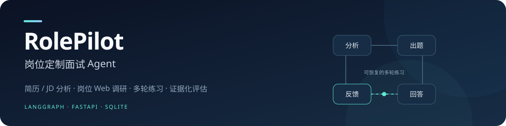
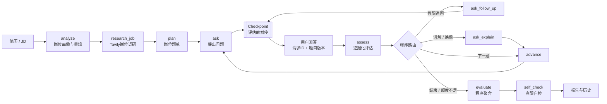

# RolePilot · 岗位定制面试 Agent



[](https://github.com/mar23jbyh-ctrl/rolepilot/actions/workflows/ci.yml)
[](docs/run.md)
[](docs/architecture.md)
[](api/main.py)
[](frontend/package.json)
[](LICENSE)

**基于 LangGraph 的岗位定制面试练习系统**：解析简历与 JD，结合 Tavily Web 检索生成岗位题单，通过有限追问与证据化评分，提供可恢复的多轮练习和岗位维度参考报告。

项目采用 LangGraph 编排程序约束的工作流型单 Agent。模型负责分析、生成和提出建议；程序负责状态转移、题目版本、工具权限、追问上限、评分聚合、持久化和调用预算。Tavily 用于岗位 Web 检索增强；项目不包含本地向量数据库或内置题库。

**核心技术：** LangGraph、FastAPI、Pydantic、SQLite、Tavily、React / TypeScript、Pytest；后端使用 Python 3.11。

> RolePilot 用于个人面试练习，不用于招聘决策、背景调查或能力认证。评分是练习参考，不能替代专家评估。简历、岗位描述和回答文字会发送到你在配置中选择的模型服务；本地 OCR 不等于全流程离线。

**快捷导航：** [核心亮点](#快速了解) · [功能](#功能) · [快速开始](#快速开始) · [Agent 架构](#架构) · [验证与证据](#开发者验证) · [深入文档](#深入证据) · [参与贡献](#参与贡献)

---

## 快速了解

工程设计围绕多轮练习中最容易出错的四个环节展开：

| 核心设计 | 实现方式 | 对练习的作用 |
|---|---|---|
| **会话可恢复** | LangGraph 检查点在评估前暂停，沿同一线程恢复 | 刷新页面或重启后端后继续练习 |
| **回答可靠提交** | 请求 ID、内容指纹、题目版本与 SQLite 事务处理权 | 处理重复请求、旧题回答和并发竞争 |
| **评分可校验** | 模型给档位与原话证据，程序校验、换算、合并和加权 | 可复算评分口径，无效输出明确无分 |
| **调用预算治理** | SDK 前上下文预检、逐次计量、整场额度与报告预留 | 为长对话提供预算边界和收尾路径 |

实现细节见 [架构说明](docs/architecture.md)，测试范围见 [评测与证据](docs/evaluation.md)。

## 功能

- 支持 TXT、DOCX、文字 PDF，以及 PNG/JPG/JPEG/BMP/WebP 简历；扫描 PDF 和图片可以使用本地 Tesseract OCR。
- 解析简历和 JD，生成岗位画像、能力差距和岗位量规。
- 通过 Tavily 按岗位职责、技能、常见问题、工作场景等方向进行 Web 调研，去重并保留来源摘要。
- 综合 JD、简历项目、岗位量规和调研摘要生成岗位专属题单。
- 根据回答中的遗漏点进行有次数上限的追问；必要时提供知识讲解或生成有限替代题。
- 面试可在评估前暂停，刷新页面或重启后端后沿同一会话继续。
- 使用请求 ID 和题目版本处理重复提交、断网重试、旧题回答和并发竞争。
- 评分模型提供能力档位和回答原话，程序校验证据后完成分数换算、追问合并和岗位维度加权。
- 保存历史会话、对话和评估报告；用户可以只读查看、重命名或删除会话。

## 架构

项目采用程序约束的单 Agent 状态图，将模型能力放在受控的流程节点中。主流程如下：



核心边界由程序执行：

- **状态图：** `analyze → research_job → plan → ask → assess → route → evaluate`。图在 `assess` 前保存检查点，回答提交后使用同一 `thread_id` 恢复。
- **可靠提交：** 业务 SQLite 保存会话和回答账本，LangGraph SQLite 保存检查点。请求 ID、内容指纹、题目版本和事务处理权共同防止重复评估及旧答案覆盖当前题目。
- **评分协议：** 模型输出结构化档位、维度和证据，程序检查字段、量规和原话是否来自当前回答；非法或缺少依据的结果不补造分数。
- **工具边界：** WebSearch 访问 Tavily；技术岗位可按条件使用 CodeExplainer 和 DynamicQuestion。CodeExplainer 只生成说明，不执行用户代码。
- **调用治理：** 统一模型调用出口执行上下文预检、逐次用量记录和整场额度预留；重试、并行工具、摘要和最终报告共用同一套台账。

## 深入证据

如果希望从产品使用进一步了解实现，可以按以下顺序阅读：

1. [架构说明](docs/architecture.md)：状态图、会话业务库与检查点库的职责、回答提交协议、评分和工具边界。
2. [评测与证据](docs/evaluation.md)：后端与前端回归、HTTP/浏览器验收和证据边界。
3. [安全、隐私与数据边界](docs/security.md)：凭据、上传清理、云端数据流和部署限制。
4. [运行指南](docs/run.md)：首次安装、OCR、单地址模式和常见错误。
5. [评分契约](docs/scoring_contract.md)：评分输入、证据校验、档位映射与聚合规则。

## 快速开始

### 环境要求

- Python 3.11；Node.js 22 或更高版本（CI 使用 Node.js 22）。
- 一个兼容 Chat Completions、支持工具调用且能遵循 JSON 输出要求的大模型服务。服务地址可配置，不限定具体厂商；结构化结果由提示词、JSON 解析和程序校验实现。
- Tavily API Key，用于岗位 Web 调研。搜索失败会被标记为降级，不会伪装成已联网。
- 使用图片或扫描 PDF 时，需要本机安装 Tesseract，并准备 `chi_sim`、`eng` 语言数据。

### Windows PowerShell

在仓库根目录执行：

```powershell
py -3.11 -m venv .venv
.\.venv\Scripts\python.exe -m pip install -r requirements.lock.txt
.\.venv\Scripts\python.exe -c "import tiktoken; tiktoken.get_encoding('o200k_base')"
npm ci --prefix frontend

if (-not (Test-Path -LiteralPath .env)) {
  Copy-Item -LiteralPath .env.example -Destination .env
}
```

编辑 `.env` 顶部配置：

```dotenv
MODEL=你的模型ID
BASE_URL=https://你的模型服务/v1
API_KEY=你的模型服务密钥
TAVILY_API_KEY=你的Tavily密钥
```

首次运行建议使用锁定依赖；`requirements.txt` 保留直接依赖声明，`requirements.lock.txt` 固定完整运行依赖。
分词器准备命令首次下载公开静态数据并缓存，不调用模型或搜索 API；之后的离线回归会阻止外部请求。

真实 `.env` 只保存在本机，不能提交 GitHub。完整参数和 DeepSeek、OpenAI、百炼、SiliconFlow、Ollama 的兼容地址示例见 [.env.example](.env.example)。原生 Anthropic 等非兼容协议当前需要额外适配。

启动开发模式：

```powershell
# 终端一：启动后端
.\.venv\Scripts\python.exe -m uvicorn api.main:app --host 127.0.0.1 --port 8000

# 终端二：启动前端
npm run dev --prefix frontend
```

浏览器打开 <http://127.0.0.1:5173>。Vite 会把 `/api` 请求代理到 8000 端口。

如果希望使用单地址模式：

```powershell
npm run build --prefix frontend
.\.venv\Scripts\python.exe -m uvicorn api.main:app --host 127.0.0.1 --port 8000
```

然后打开 <http://127.0.0.1:8000>。健康检查为 <http://127.0.0.1:8000/api/health>，API 文档为 <http://127.0.0.1:8000/docs>。

Linux/macOS 将 Python 路径替换为 `.venv/bin/python`，其余命令相同。安装示例以 Windows 开发环境为主要验证环境，其他平台可按相同依赖和配置运行。

### OCR（可选）

只使用 TXT、DOCX 或文字 PDF 时可以不安装 OCR。需要图片或扫描 PDF 时：

```powershell
.\.venv\Scripts\python.exe -X utf8 scripts/install_ocr_languages.py
```

确认 Tesseract 可执行并包含中文、英文语言包后再上传文件。OCR 结果会先进入可编辑文本框，用户确认后才用于创建面试；建议检查识别结果。

## 使用流程

1. 上传简历或粘贴简历文字。
2. 粘贴 JD，或上传岗位图片并检查 OCR 结果。
3. 修正材料后点击“开始面试”。
4. 回答当前问题；系统会根据回答缺口追问、讲解、换题或继续下一题。
5. 点击“结束并评估”，或让题单自然结束，查看岗位维度参考报告。
6. 在历史列表中只读查看、重命名或删除已保存会话。

首次访问会创建匿名 Bearer 凭据。凭据保存在浏览器同源存储中；切换 `localhost` 与 `127.0.0.1`、切换端口或清除站点数据，可能导致当前浏览器无法访问原会话。

## 配置重点

| 配置 | 默认值 | 作用 |
|---|---:|---|
| `TARGET_QUESTIONS` / `MIN_QUESTIONS` / `MAX_QUESTIONS` | 15 / 12 / 18 | 题单数量边界 |
| `MAX_FOLLOW_UPS` / `MAX_TOTAL_FOLLOW_UPS` | 3 / 12 | 单题和整场追问上限 |
| `MAX_TOOL_ROUNDS` | 2 | 工具调用轮数；单批工具最多 8 次、最多 4 个并行线程 |
| `CONTEXT_BUDGET` / `MAX_OUTPUT_TOKENS` | 16000 / 2048 | 单次上下文和默认输出请求值 |
| `SESSION_TOKEN_BUDGET` / `FINAL_REPORT_TOKEN_RESERVE` | 500000 / 50000 | 整场额度与报告预留额度 |
| `COMPRESS_THRESHOLD` / `KEEP_RECENT_MESSAGES` | 12000 / 12 | 长对话摘要触发阈值与近期消息保留量 |
| `GRADE_THRESHOLDS` / `DIFFICULTY_WEIGHTING` | `8,6,4` / `true` | 参考等级线与难度加权开关 |

预算是保守的程序控制，不是供应商账单硬上限。模型或供应商没有返回有效 usage 时，系统会保留未知占额，而不是填成零；Tavily、OCR、托管和供应商实际账单不计入模型 Token 台账。

## 数据与隐私

- 会话、回答账本、调用台账和报告保存在 `data/` 下的 SQLite 文件中；LangGraph 检查点使用独立 SQLite 文件。
- 上传原件只在解析期间使用，成功或失败后都会尝试清理。
- 删除会话会清理业务记录、回答缓存、调用台账、预算记录和对应检查点。
- 服务端从匿名凭据推导 owner，不信任客户端直接提交的 owner 字段。
- 出口会过滤常见联系方式和身份标记，默认关闭外部追踪；这不是完整匿名化。
- 必要的简历、JD 和回答文字仍会发送到配置的模型服务，云服务的留存和训练政策由部署者自行确认。

## 开发者验证

测试依赖安装：

```powershell
.\.venv\Scripts\python.exe -m pip install -r requirements-dev.txt
.\.venv\Scripts\python.exe -X utf8 -m pytest -q
npm test --prefix frontend
npm run build --prefix frontend
```

2026-09-14 公开回归结果：

| 检查 | 结果 |
|---|---|
| 后端 Pytest | **659 passed，7 skipped**（可选历史库回放） |
| 前端测试 | **41 passed** |
| TypeScript / Vite | **类型检查与构建通过** |

测试使用合成材料和模型/搜索桩，验证程序行为；本机 HTTP、SQLite 与浏览器验收的范围见 [评测与证据](docs/evaluation.md)。最新远程结果可在 [GitHub Actions](https://github.com/mar23jbyh-ctrl/rolepilot/actions/workflows/ci.yml) 查看。

还可执行不访问云端的本机 HTTP 集成验证：

```powershell
.\.venv\Scripts\python.exe -X utf8 scripts/delivery_smoke.py --execute --output docs/release/evidence/my-smoke
```

输出目录需尚不存在。该命令启动隔离的 Uvicorn 服务，以合成材料和 SDK/搜索桩验证真实状态图、SQLite、请求重放、服务重启和删除。其他工具的用途见 [scripts/README.md](scripts/README.md)。GitHub Actions 配置会在提交和 PR 中运行离线回归与前端构建。

## 项目结构

```text
api/                         FastAPI 路由、匿名身份、上传与会话接口
app/
  graph/                     状态 Schema、节点路由、检查点和运行边界
  nodes/                     分析、调研、题单、提问、评估、摘要和报告
  scoring/                   评分协议校验与程序聚合
  llm/                       兼容模型 API、重试、预检和统一调用出口
  tools/                     WebSearch、CodeExplainer、DynamicQuestion
  parsers/                   简历抽取、本地 OCR 和 PDF 渲染
  session/                   业务 SQLite、回答幂等和操作处理权
  telemetry/                 用量台账、预算、价格快照和汇总
frontend/                    React + TypeScript + Vite 界面
tests/                       离线回归与合成测试夹具
scripts/                     OCR 安装和开发验证工具
docs/                        架构、评测、安全、运行和评分契约
```

## 边界与验证范围

- **模型接口：** 当前使用可配置的 OpenAI-compatible Chat Completions 和工具调用；JSON 输出由程序解析校验，未启用原生 `json_schema` 响应模式。不同原生协议需要适配层。
- **评分边界：** 程序保证评分字段、证据和聚合口径可复算，报告用于练习反馈，不代表专家一致性或招聘效度。
- **输入与部署边界：** OCR 结果受文档版式和语言包影响；当前项目面向本机或受控环境，未完成企业账户、多租户、HTTPS、防滥用和生产多 Worker 方案。

检查点恢复、跨数据库故障边界、外部调用重试语义和自检覆盖范围见 [架构说明](docs/architecture.md)、[评测与证据](docs/evaluation.md) 和 [安全、隐私与数据边界](docs/security.md)。

## 许可

项目代码采用 [MIT License](LICENSE)。第三方依赖、模型服务和测试资料的边界见 [THIRD_PARTY_NOTICES.md](THIRD_PARTY_NOTICES.md)。

## 参与贡献

欢迎通过 [Issue](https://github.com/mar23jbyh-ctrl/rolepilot/issues) 反馈问题，或提交 [Pull Request](https://github.com/mar23jbyh-ctrl/rolepilot/pulls)。问题报告请附运行环境、复现步骤与脱敏后的错误信息；涉及简历、JD 或回答时，请使用合成材料。修改后按上面的验证命令运行相关测试，功能或配置变化请同步更新文档。
