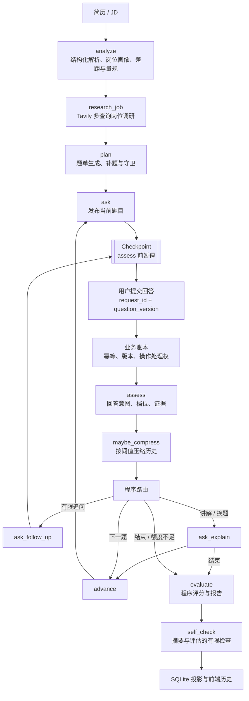

# RolePilot 架构说明

本文介绍 RolePilot 的运行架构、关键工程设计和适用边界，帮助使用者和评审者理解一次面试会话如何被创建、暂停、恢复和评估。

## 系统定位

RolePilot 是程序约束的工作流型单 Agent。LangGraph 状态图负责组织节点和恢复位置；模型负责结构化分析、题目生成、回答判断和文字反馈；程序负责路由条件、输入输出校验、评分聚合、持久化、并发保护和调用预算。

多个节点和多次模型调用共同组成一个受控 Agent 流程；节点之间没有独立 Agent 委派或自主创建节点的机制。

## 主流程

图在 `assess` 前编译中断。用户思考期间不占用 Python 请求线程；回答请求沿同一 `thread_id` 恢复图。当前 `thread_id` 使用会话 ID。[`app/graph/builder.py`](../app/graph/builder.py) 负责编译中断点，[`app/service.py`](../app/service.py) 负责恢复回答。

## 节点职责

| 节点 | 作用 | 程序约束 |
|---|---|---|
| `analyze` | 解析简历、JD、岗位画像、差距和岗位量规 | 结构化字段、有限重试和降级 |
| `research_job` | 对岗位职责、技能、常见问题、工作场景和能力要求进行 Web 调研 | 固定查询类别、来源去重、域名等级和失败状态 |
| `plan` | 结合简历项目、JD、量规和检索摘要生成题单 | 题量范围、来源绑定、补题次数和题目守卫；项目排序后仍保留原简历索引 |
| `ask` / `ask_follow_up` / `ask_explain` | 分别发布主问题、追问、讲解或替代题 | 当前题目版本、回答清空和问题类型 |
| `assess` | 判断回答意图、岗位维度档位、原话证据和下一步建议 | 评分协议、证据匹配和无效结果无分 |
| `advance` | 进入下一道题并根据近期有效评分调整难度 | 题单边界和有限难度规则 |
| `evaluate` | 合并主问题与追问，计算岗位维度分数和等级 | 程序换算、加权和缺失维度处理 |
| `maybe_compress` | 达到阈值时摘要历史并保留近期消息 | 摘要调用纳入预算，不丢弃当前回答 |
| `self_check` | 在生成报告后检查摘要与评估结果，独立保存检查结论 | 不重新审计全部历史消息，也不等于报告质量认证 |

## 状态与持久化

图状态包含岗位材料、岗位量规、题单、当前题目、题目版本、回答、评估、摘要、工具记录、用量和报告。历史消息会按配置压缩和保留，因此检查点是恢复状态，而不是无限、无损的事件日志。

每个 owner 的会话状态分别保存在两类 SQLite 数据库中：

1. **业务 SQLite**：会话、回答请求、状态投影、调用台账和整场预算。
2. **LangGraph SQLite**：检查点、下一待执行节点和恢复信息。

匿名凭据到 owner 的映射另存于身份 SQLite，独立于上述会话存储。会话业务库与检查点库在正常流程中互相核对，但没有跨数据库原子事务。外部模型请求也不与本地数据库组成分布式事务，因此系统不能承诺外部调用 exactly-once。

### 浏览器身份与环境切换

身份库保存稳定的 `server_id`，它只用于区分数据环境，不授予数据访问权。前端先获取 `/api/auth/context`，再携带该环境保存的 Bearer 调用 `/api/auth/anonymous`：有效凭据复用同一 owner，无法解析的凭据由服务端重新签发。数据库或网络故障不会当成凭据失效而创建新身份。

活动会话、草稿和待确认回答按 `server_id` 与匿名身份隔离；旧浏览器记录只有在原凭据验证通过后才迁移。切换环境时保留已编辑的简历与 JD，重载当前环境的历史和活动会话，切回原环境可继续读取原恢复记录。原会话的回答、停止、改岗位和删除请求不会因凭据恢复而自动重发；在业务执行前被鉴权拒绝的上传、历史列表与新面试请求最多恢复一次。

## 回答提交协议

前端在发送前冻结 `answer_request_id`、题目版本和回答正文；网络不确定时重试同一组值。后端在 SQLite 事务中：

- 用会话 ID 和请求 ID 查找已有请求；同 ID、同版本、同正文返回缓存结果；
- 同 ID 但正文或版本不同，返回幂等冲突；
- 新请求携带旧题目版本，返回过期题目错误；
- 同一会话同时只能有一个活动写操作，避免回答、停止、改岗位和删除互相覆盖；
- 图已记录可信完成结果而业务投影失败时，允许补写投影；无法确认完成边界时标记恢复状态，不盲目重跑外部模型。

这套协议保证本地回答请求的幂等和恢复边界；外部供应商是否支持全局幂等，仍取决于供应商接口。

## 评分边界

`assess` 的模型输出包含岗位维度档位和回答原话证据等字段。程序会检查字段类型、量规键、档位范围，以及证据是否来自当前回答；非法输出不补造分数。

结构化 JSON 由提示词约束、解析与程序校验实现，当前调用没有启用供应商原生 `response_format=json_schema`。简历项目经过排序和截断后保留原始索引，题单校验、提问与评估沿用同一来源，避免引用错位。

随后程序将档位映射为数值，合并同一主问题的追问，按已覆盖维度和岗位量规进行加权聚合。最终总分和等级由程序结果决定，模型生成的总分只作为辅助信息。该协议保证计算口径可复算，但不等同于专家标注或招聘效度认证。

## 工具与 Web 检索增强

岗位研究由程序按固定类别调用 Tavily，成功结果会去重、按域名和时间整理，并以受限片段送入题单规划。这是 Web 检索增强子流程；项目不维护本地向量索引、embedding、BM25、Chroma 或固定题库。

技术岗位可按条件开放 `CodeExplainer` 和 `DynamicQuestion`。工具参数由 Pydantic 模型生成并严格校验，调用权限、批量数量和轮数由程序限制。`CodeExplainer` 只生成解释，不执行代码。

## 上下文与调用预算

统一模型调用出口在每次外部尝试前估算序列化消息和工具定义，加入安全余量并为输出预留空间；超过上下文边界时降低输出上限或在 SDK 前拒绝，不静默丢弃当前回答。

整场预算在 SQLite 中原子预留。重试、并行工具、历史摘要和最终报告都记录在同一台账；未知 usage 保留占额，进程重启不会把未知调用当成零。普通流程为最终报告保留额度，预算不足时保留已提交回答并安全收尾。

## 相关源码入口

- 图编排：[app/graph/builder.py](../app/graph/builder.py)、[app/graph/edges.py](../app/graph/edges.py)
- 状态和运行边界：[app/graph/schema.py](../app/graph/schema.py)、[app/graph/runtime.py](../app/graph/runtime.py)
- 服务、恢复和删除：[app/service.py](../app/service.py)、[app/session/store.py](../app/session/store.py)
- 评分：[app/scoring/protocol.py](../app/scoring/protocol.py)、[app/nodes/assess.py](../app/nodes/assess.py)、[app/nodes/evaluate.py](../app/nodes/evaluate.py)
- 调用和预算：[app/llm/client.py](../app/llm/client.py)、[app/context/budget.py](../app/context/budget.py)、[app/telemetry/ledger.py](../app/telemetry/ledger.py)
- 工具：[app/tools/schemas.py](../app/tools/schemas.py)、[app/tools/executor.py](../app/tools/executor.py)
- 浏览器身份：[app/security.py](../app/security.py)、[api/routers/auth.py](../api/routers/auth.py)、[frontend/src/api/client.ts](../frontend/src/api/client.ts)、[frontend/src/api/browserSession.ts](../frontend/src/api/browserSession.ts)
